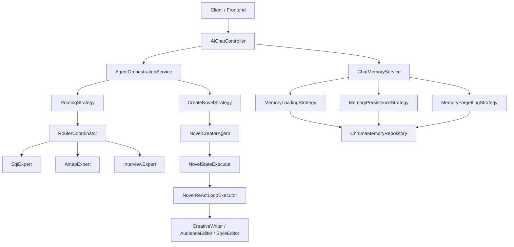
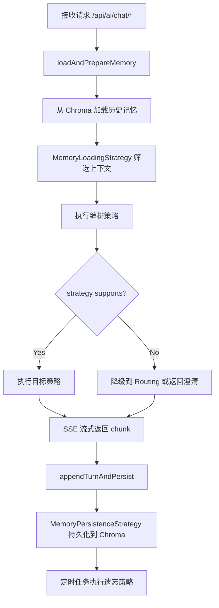

# AI Helper

一个基于 `Spring Boot + LangChain4j` 的多智能体后端项目，支持流式对话、路由编排、会话记忆（Chroma 向量库）、SQL/RAG 检索与小说创作等场景。

## 特性概览

- 双编排模式：`routing`（快速）与 `orchestrator`（高质量）。
- SSE 流式输出：后端按 token/chunk 推送，适配实时聊天体验。
- 多专家能力：SQL 查询、地图/天气（高德 MCP）、面试问答等。
- 会话记忆系统：基于 Chroma 的记忆加载、持久化与定时遗忘。
- SQL 安全护栏：默认阻断写操作语义（如 `delete/update/drop`）。
- Prompt 治理：系统 Prompt 与模板资源集中登记，便于追踪与回归。
- 自带调试页面：`chat-debug.html` 可直接联调流式接口与记忆管理。
- 回归脚本：内置 PowerShell 脚本，可快速验证记忆与提示词效果。

## 技术栈

- Java 21
- Spring Boot 3.5.13
- Maven
- LangChain4j（含 Agentic、MCP、Chroma、SQL Experimental 等模块）
- MyBatis + MySQL
- Chroma 向量数据库
- Reactor（Flux）流式响应

## 架构速览

### 1) 编排策略

- `routing`：面向通用问答与工具型请求，强调低延迟与成本效率。
- `orchestrator`：面向复杂创作（当前重点为小说创作），支持多步骤推理与状态流转。

### 2) 会话记忆

- 每个会话通过 `memoryId` 隔离上下文。
- 会话历史落盘到 Chroma，并在下次会话加载。
- 定时任务每 6 小时执行遗忘策略，清理低价值历史记忆。

### 3) 工具与检索

- SQL 专家结合 RAG 元数据检索，辅助生成并执行只读查询。
- 地图能力通过 MCP 对接高德服务。
- Web 搜索能力通过 MCP 对接智谱服务。

## 项目结构图



## 目录结构（核心）

```text
ai-helper
├─ src/main/java/com/example/aihelper
│  ├─ controller            # SSE 对话接口、记忆管理接口
│  ├─ service               # 编排与记忆服务
│  ├─ service/strategy      # 路由/编排策略实现与工厂
│  ├─ agent                 # 路由协调器、小说创作智能体、专家能力
│  ├─ memory                # Chroma 仓储、记忆加载/持久化/遗忘策略
│  ├─ rag                   # 元数据抽取与向量检索
│  └─ config                # 模型、向量库、MCP、CORS 等配置
├─ src/main/resources
│  ├─ application.yaml
│  ├─ templates             # system/user/novel 提示词模板
│  ├─ static/chat-debug.html
│  └─ sql/hmdp.sql
└─ scripts/run-regression.ps1
```

## 核心流程图



## 核心设计方案（重点）

### 1) 记忆管理设计

#### 1.1 记忆加载策略（加载 / 检索 / 召回）

- 入口：`ChatMemoryService.loadAndPrepareMemory`，先从向量库按 `sessionId` 拉取候选，再执行加载策略。
- 召回模型：`MemoryLoadingStrategy` 使用**双通道召回**：
  - `recent channel`：保留近期对话，保证时序连续性；
  - `importance channel`：召回高价值历史，保证长期约束不丢失。
- 统一排序：对候选计算融合分数，核心维度包括：
  - 重要度（importance）
  - 时间新鲜度（recency）
  - 词法相关性（relevance）
  - 实体命中（entity match）
- 预算与约束：
  - `maxInputTokens` 控制上下文总量；
  - `recentMin` / `importanceMin` 保证双通道最低覆盖；
  - 文本去重 + 覆盖兜底，避免“全是重复上下文”或“没有相关上下文”。

#### 1.2 记忆遗忘策略（滑动窗口 + 重要度）

- 定时触发：每 6 小时执行一次遗忘任务。
- 会话维度处理：按 `session_id` 分组，逐会话决策删除列表。
- 删除规则：
  1. 保留最近 `N` 条（滑动窗口，默认 50）；
  2. 超窗部分按重要度阈值筛除（低于阈值才删除）；
  3. 逐条删除 Chroma 记录，失败单条容错不影响全局任务。
- 设计目标：优先保护“近期上下文 + 高价值长期记忆”，清理寒暄噪声和低价值历史。

#### 1.3 记忆持久化策略（存储结构 + 增量写入）

- 持久化时机：每轮对话完成后执行 `appendTurnAndPersist`。
- 增量检测：使用消息签名缓存（`role + content`）避免重复落库。
- 向量库存储结构（metadata）：
  - `session_id`, `user_id`, `role`, `document_id`
  - `importance_score`, `created_at`, `updated_at`, `status`, `access_count`
- 策略拆分：
  - `MemoryImportanceScoringStrategy` 负责打分；
  - `MemoryPersistenceStrategy` 负责写入；
  - `ChromaMemoryRepository` 只负责向量库读写，不承载业务判断。

---

### 2) 提示词管理设计

#### 2.1 统一治理

- `PromptRegistry` 统一登记 Prompt 资产（ID、来源、位置），避免“散落式硬编码”。
- `PromptGovernanceReporter` 启动期输出治理统计，便于审计模板覆盖率。

#### 2.2 动态拼接规则

- `NovelPrompts` 按状态生成 Prompt：分析、草稿评估、改进、最终审定。
- 变量注入采用模板化拼接（主题 / 受众 / 风格 / 反馈），保证同一流程可复用。
- `PromptTemplateLoader` 支持“资源模板 + fallback 文本”，避免文件丢失导致流程中断。

#### 2.3 多场景模板切换

- 路由场景：`router` 系统提示词。
- 专家场景：`amap`、`interview` 专家系统提示词。
- 创作场景：`novel` 分阶段模板。
- 切换依据：由编排策略 + 状态机节点共同决定。

#### 2.4 上下文压缩与截断

- 加载阶段通过 token 预算控制注入上下文长度。
- Prompt 阶段对长文本进行截断（如草稿/推理内容），防止上下文爆炸。
- 日志侧统一使用摘要输出，减少敏感与冗余信息。

---

### 3) 工具防误调设计

#### 3.1 路由防误调

- `RouteIntentGuard` 对地图/面试等工具路由做高置信判定。
- 低置信或冲突意图时，不直接调用工具，而是返回澄清问题，降低误调用成本。

#### 3.2 参数合法性校验

- 典型案例：`InterviewQuestionTool` 对关键词做长度、字符集与安全模式校验。
- 非法参数直接拦截并返回可读提示，不进入外部调用。

#### 3.3 敏感操作拦截

- SQL 工具默认只读：
  - 请求文本中发现写语义（delete/update/drop/...）直接阻断；
  - 结果文本出现写 SQL 迹象时二次阻断（双层护栏）。

#### 3.4 错误反馈与稳定性

- 工具异常统一转业务可读消息；
- SSE 流程层提供 `onErrorResume` 兜底，前端可稳定消费错误事件。
- 当前已具备基础“降级 + 拦截 + 反馈”；重试/熔断可按后续版本接入统一组件。

---

### 4) 智能体编排设计

#### 4.1 多智能体协作

- `routing`：面向通用问答和工具任务，强调速度。
- `orchestrator`：面向复杂创作，强调过程控制与质量。

#### 4.2 拆解与分发

- 以小说创作为例，拆分为：分析 -> 草稿 -> 评估 -> 编辑 -> 评估 -> 风格 -> 审定。
- 各子阶段由不同专家角色执行（创作、受众编辑、风格编辑）。

#### 4.3 调度与执行链路

- `AgentOrchestrationServiceImpl` 负责策略选择、支持性判断与回退。
- 支持“灰区意图澄清”（例如疑似小说创作但信号不充分），减少误降级。

#### 4.4 串并行控制

- 核心业务流程采用串行状态推进，保证可解释性和上下文一致性。
- 流式输出采用异步执行（线程池 + Flux），兼顾吞吐与交互体验。

---

### 5) 回退与降级设计

- 策略回退：`orchestrator` 不支持时自动降级 `routing`，并附带提示信息。
- 状态回退：阶段评估不通过时，回退到上一步重试（如草稿重写、编辑重做）。
- 部分成功：ReAct 循环达到上限时可返回 `partialSuccess`，避免全量失败。
- 失败兜底：出现不可恢复异常时转 `FAILED` 状态并输出错误详情。

---

### 6) 状态机 + ReAct 设计

#### 6.1 状态机模型

- 状态枚举覆盖完整生命周期：`INIT -> ... -> COMPLETED/FAILED`。
- `StateTransition` 统一记录：下一状态、动作名、结果、成功标记、错误信息。

#### 6.2 ReAct 闭环

- `Reason`：评估当前产物是否达标；
- `Act`：根据评估意见生成改进版本；
- `Observe`：判断是否完成，若未完成进入下一轮迭代。

#### 6.3 上下文与轨迹

- `NovelCreationContext` 管理流程变量（topic、audience、style 及各阶段产物）。
- 全局迭代计数 + 状态内迭代上限双重限制，防止无限循环。
- 结合 traceId 和结构化日志可实现执行轨迹追踪与问题回放。

---

### 7) SQL 专家命中率与准确率设计

#### 7.1 检索命中质量（Recall）

- SQL 专家先调用 `MetadataVectorStore.searchRelevantTables(request, topK)` 召回相关表结构与字段语义，再执行 SQL 生成与查询。
- 候选表采用 TopK 控制（默认 `topK=5`），平衡召回覆盖与上下文噪声。
- 检索结果作为 SQL 检索器上下文输入，降低自然语言直接生成 SQL 的表名/字段偏差。

#### 7.2 SQL 生成准确率（Precision）

- 通过检索出的 schema 上下文约束 SQL 生成范围，减少跨表误联结与字段幻觉。
- 查询路径统一为只读语义，阻断 `delete/update/insert/drop/...` 等写操作关键词。
- SQL 执行结果统一汇总为文本响应，并保留关键日志用于链路追踪。

#### 7.3 执行校验与安全护栏（Guardrail）

- 执行前：请求文本先做写操作语义检测，不满足只读约束则直接拦截。
- 执行后：结果文本再做一次写操作语义检测，命中风险则二次阻断返回。
- 异常处理：执行失败时返回业务可读错误信息，避免系统异常直接暴露。

#### 7.4 质量评估指标

- `Table Recall@K`：目标表是否被召回到 TopK。
- `SQL Exact Match`：生成 SQL 与标准 SQL 的结构匹配度。
- `Execution Accuracy`：执行结果与预期答案一致性。
- `Safety Block Rate`：危险查询拦截率与误拦截率。

## 快速开始

### 1) 前置依赖

- JDK 21（必须）
- Maven 3.9+（或直接使用项目内 `mvnw`）
- MySQL 8+
- Chroma（默认 `http://localhost:8000`）
- Node.js（用于启动 Amap MCP server，Windows 默认使用 `npx.cmd`）

### 2) 初始化数据库

创建数据库并导入示例数据：

```sql
CREATE DATABASE hmdp DEFAULT CHARACTER SET utf8mb4;
```

然后执行：

- `src/main/resources/sql/hmdp.sql`

### 3) 配置应用

项目默认配置文件为 `src/main/resources/application.yaml`。密钥项通过环境变量注入。

可参考以下配置项（示例值均为占位符）：

```yaml
spring:
  datasource:
    url: jdbc:mysql://localhost:3306/hmdp?useUnicode=true&characterEncoding=utf-8&useSSL=false&serverTimezone=Asia/Shanghai
    username: root
    password: your_mysql_password

langchain4j:
  community:
    dashscope:
      chat-model:
        model-name: qwen-plus-2025-07-28
        api-key: ${DASHSCOPE_API_KEY}
      streaming-chat-model:
        model-name: qwen-plus-2025-07-28
        api-key: ${DASHSCOPE_API_KEY}

bigmodel:
  api-key: ${ZHIPU_API_KEY}
gaodemodel:
  api-key: ${AMAP_API_KEY}

chroma:
  base-url: http://localhost:8000
  memory-collection-name: chat_memories
  metadata-collection-name: db_metadata

mcp:
  node-home: D:\\nodejs
  npx-executable: npx.cmd
```

### 4) 启动项目

Windows:

```powershell
.\mvnw.cmd spring-boot:run
```

Linux / macOS:

```bash
./mvnw spring-boot:run
```

默认启动后：

- 服务地址：`http://localhost:8081`
- Context Path：`/api`

## 本地联调

### 1) 调试页面

浏览器打开：

- `http://localhost:8081/api/chat-debug.html`

页面支持：

- routing / orchestrator 策略切换
- 流式输出观察
- 清理会话记忆
- 查看历史消息

### 2) 主要接口

1. 流式对话（快速模式）

```http
GET /api/ai/chat/routing?memoryId=1&message=你好
Accept: text/event-stream
```

2. 流式对话（高质量模式）

```http
GET /api/ai/chat/orchestrator?memoryId=1&message=帮我写一篇科幻小说大纲
Accept: text/event-stream
```

3. 清除会话记忆

```http
DELETE /api/memory/clear/{sessionId}
```

4. 查询会话历史

```http
GET /api/memory/history/{sessionId}
```

## 回归测试脚本

项目提供了基础回归脚本：

- `scripts/run-regression.ps1`

执行方式（PowerShell）：

```powershell
powershell -ExecutionPolicy Bypass -File .\scripts\run-regression.ps1
```

可覆盖参数（示例）：

```powershell
powershell -ExecutionPolicy Bypass -File .\scripts\run-regression.ps1 `
  -BaseUrl "http://localhost:8081/api" `
  -MemoryIterations 5 `
  -ForgettingIterations 5 `
  -OutputDir "benchmark\results"
```

## 配置说明（重点）

- `sql-guard.write-operation-hints`：SQL 写操作关键字护栏。
- `route-guard.*-keywords`：路由防误调关键词。
- `novel-agent.*`：小说创作智能体的迭代、截断等参数。
- `metadata.vectorize-on-startup`：是否在启动时进行元数据向量化。
- `auth.*`：轻量鉴权相关参数（当前拦截默认关闭）。

## 贡献指南

欢迎提交 Issue 与 PR：

1. Fork 本仓库并创建特性分支
2. 提交清晰的 Commit 信息
3. 为关键逻辑补充测试与文档
4. 发起 PR 并描述变更动机与验证方式

## 致谢

- [Spring Boot](https://spring.io/projects/spring-boot)
- [LangChain4j](https://github.com/langchain4j/langchain4j)
- [Chroma](https://github.com/chroma-core/chroma)

